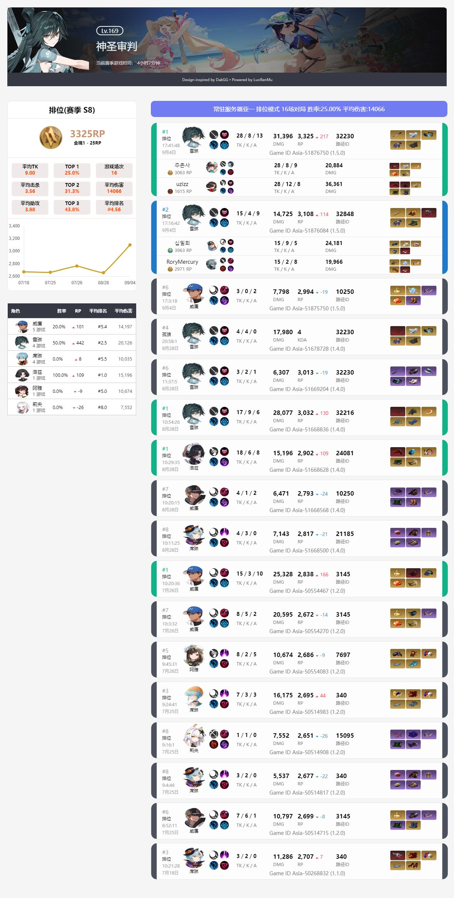
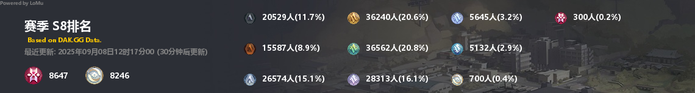

# 说明

永恒轮回战绩查询机器人 ~~螺母-Bot~~

## 部署使用

    使用OneBot协议框架 NapCat LLOneBot Lagrange.Core

1.application.yaml 配置文件

2.character.txt实验体名称映射

3.player.txt 玩家名称映射

### 表情包生成

该功能完全来自petpet
使用它 首先需要下载[petpet-template](https://github.com/Dituon/petpet-templates/tree/main/templates)

将其中的templates文件放至根目录即可启用表情包生成

json文件中的alias表示调用命令 需以/开头

所有的调整都需要重启生效

#### 自编辑表情包模板

生成公共场合不宜展示内容或关于BSER表情包？

请访问[petpet-js](https://github.com/Dituon/petpet-js)

#### BOT指令

##### 玩家查询

```text
查询玩家 神圣审判
查询战绩 神圣审判
战绩查询 神圣审判
search 神圣审判
```



##### 分数报告

```text
永恒多少分
半神多少分
永恒分段
半神分段
```



##### 以下命令均为不可靠 依赖网络

`我在学校中的网络测试 部分因网络因素无法正常运行`

**网页查询玩家**

网页截图

```text
网页查询玩家 神圣审判
```

**查询实验体**

支持谐音

```text
查询角色 杰琪 0/1/2/3
```

**查询路线**

```text
查询路线 12345
routes 12345
```

**实验体统计**

```text
实验体统计
角色统计
英雄统计
statistics
```

**官网更新截图**

```text
该命令监听https://playeternalreturn.com/posts/news/([0-9]{4,6})形式消息
```

特别感谢 [petpet](https://github.com/Dituon/petpet)、[shiro](https://github.com/MisakaTAT/Shiro/)

由liteLoaderNTQQ OneBotV11 强力驱动
